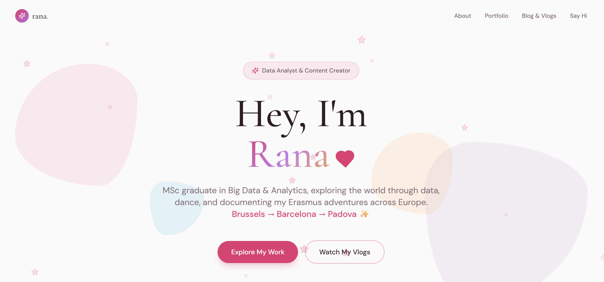

# My Digital Universe 🌌

A personal digital garden, portfolio, and content platform built to share stories, vlogs, and thoughts.

[**View Live Site**](https://ranaislek.vercel.app)



## 🚀 About The Project

This project started as a design experiment using Lovable but evolved into a full-stack engineering challenge. It is a completely custom Single Page Application (SPA) designed to be fast, responsive, and easy to manage.

**Key Features:**
*   **Dynamic Content System:** A custom-built CMS powered by Supabase.
*   **Admin Dashboard:** A secure route (`/admin`) to write blogs, publish vlogs, and manage content without touching code.
*   **Modern UI/UX:** Built with Tailwind CSS and Framer Motion for smooth transitions and a premium feel.
*   **Global Deployment:** Hosted on Vercel with optimized routing.

## 🛠️ Tech Stack

*   **Frontend:** React, TypeScript, Vite
*   **Styling:** Tailwind CSS, Lucide Icons
*   **Backend / Database:** Supabase (PostgreSQL)
*   **Deployment:** Vercel

## 📦 Getting Started

### Prerequisites
*   Node.js installed
*   A Supabase project (for the database)

### Installation

1.  **Clone the repo**
    ```bash
    git clone https://github.com/ranaislek/my-digital-universe.git
    cd my-digital-universe
    ```

2.  **Install dependencies**
    ```bash
    npm install
    ```

3.  **Environment Setup**
    Create a `.env` file in the root directory and add your Supabase keys:
    ```env
    VITE_SUPABASE_URL=your_supabase_url
    VITE_SUPABASE_ANON_KEY=your_supabase_anon_key
    ```

4.  **Run Development Server**
    ```bash
    npm run dev
    ```

## 📝 Admin Access
The project includes a hidden admin route at `/admin`.
*   **Default Password:** `ranaislek123` (Configurable in `AdminPage.tsx`)
*   **Features:** Create Drafts, Publish Posts, Delete Content.

## 🤝 Contributing
This is a personal portfolio, but feel free to fork it and use it as a template for your own digital universe!

## 📄 License
Distributed under the MIT License. See `LICENSE` for more information.
